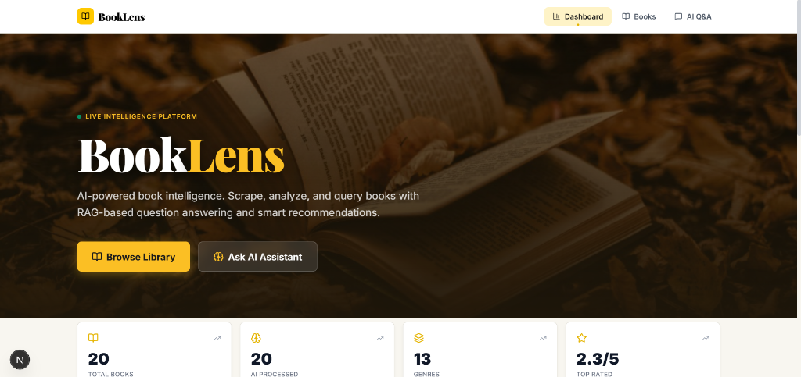
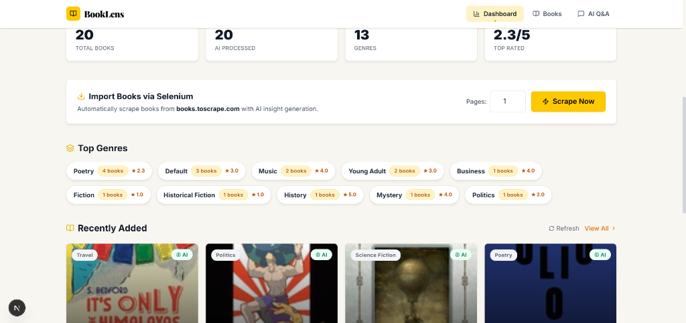
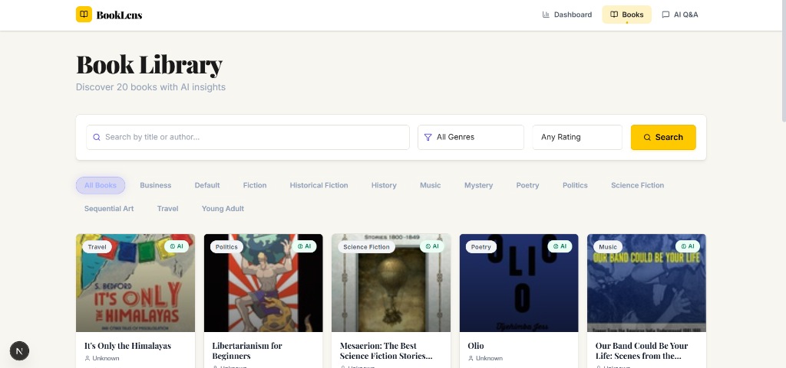
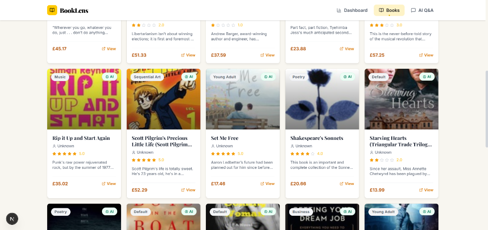
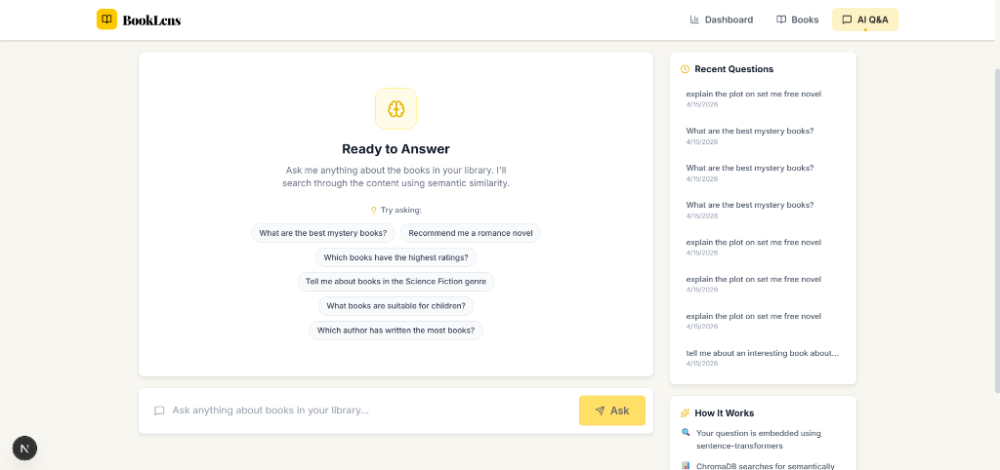

# 📚 BookLens — AI-Powered Book Intelligence Platform

A full-stack web application that combines **web scraping**, **AI-driven insights**, and **RAG-based question answering** to build an intelligent book discovery and analysis platform.

> Scrape → Analyze → Query — all powered by AI.

---

## 📸 Screenshots

### Homepage — Hero Dashboard


### Dashboard — Stats & Scraper


### Book Library — Browse & Filter


### Library — Book Cards with AI Badges


### AI Q&A — RAG-Powered Chat Assistant


---

## 🎯 Key Features

### 1. Web Scraping Pipeline
- **Automated scraping** from [books.toscrape.com](http://books.toscrape.com) using Requests + BeautifulSoup
- Extracts title, author, rating, price, genre, description, UPC, availability, and cover images
- Configurable page count with deduplication logic
- Background processing with real-time status updates

### 2. AI-Powered Book Insights
Each scraped/uploaded book is automatically analyzed to generate:
- **AI Summary** — Concise, engaging 2–3 sentence summaries
- **Genre Classification** — Primary genre, subgenre, and reasoning
- **Sentiment Analysis** — Tone analysis of the book's description
- **Recommendation Engine** — "If you like X, you'll like Y" style suggestions

### 3. RAG Question Answering (Retrieval-Augmented Generation)
- **ChromaDB** vector database for semantic book indexing
- **sentence-transformers** (`all-MiniLM-L6-v2`) for local, free text embeddings
- Smart text chunking with configurable overlap for optimal retrieval
- LLM-generated answers with **source citations** linking back to specific books
- Chat-style interface with conversation history

### 4. LLM Fallback Chain
Resilient multi-provider AI backend:
```
Google Gemini → OpenAI GPT → Rule-based fallback
```
If one provider is unavailable or quota-exhausted, the system automatically tries the next.

---

## 🛠️ Tech Stack

| Layer | Technology |
|-------|-----------|
| **Frontend** | Next.js 16, React 19, TypeScript, Tailwind CSS 4 |
| **Backend** | Django 4.2, Django REST Framework |
| **Database** | SQLite (relational), ChromaDB (vector store) |
| **AI/LLM** | Google Gemini API, OpenAI API (with fallback chain) |
| **Embeddings** | sentence-transformers (`all-MiniLM-L6-v2`) — runs locally, no API key needed |
| **Scraping** | Requests + BeautifulSoup4 |
| **UI Libraries** | Lucide React (icons), Framer Motion (animations), react-hot-toast |

---

## 📁 Project Structure

```
BookLens/
├── backend/
│   ├── booklens/           # Django project settings & root URLs
│   │   ├── settings.py
│   │   ├── urls.py
│   │   └── wsgi.py
│   ├── books/              # Books app — models, views, scraper, serializers
│   │   ├── models.py       # Book, AIInsight, BookChunk, QAHistory models
│   │   ├── views.py        # REST API views (CRUD, scrape, recommendations)
│   │   ├── scraper.py      # Web scraping logic (books.toscrape.com)
│   │   ├── serializers.py  # DRF serializers
│   │   └── urls.py
│   ├── ai_engine/          # AI services module
│   │   ├── services.py     # LLM calls, RAG pipeline, ChromaDB, embeddings
│   │   ├── views.py        # Q&A and insight generation endpoints
│   │   └── urls.py
│   ├── requirements.txt
│   └── .env                # API keys & config
│
├── frontend/
│   ├── app/
│   │   ├── page.tsx        # Dashboard/Home (hero wallpaper + stats)
│   │   ├── books/          # Book listing & detail pages
│   │   │   ├── page.tsx
│   │   │   └── [id]/page.tsx
│   │   ├── qa/page.tsx     # AI Q&A chat interface
│   │   ├── layout.tsx      # Root layout with fonts & navbar
│   │   └── globals.css     # Design system & component styles
│   ├── components/
│   │   ├── Navbar.tsx
│   │   ├── BookCard.tsx
│   │   └── LoadingSpinner.tsx
│   ├── lib/
│   │   └── api.ts          # Axios API client & type definitions
│   └── .env.local          # Frontend environment variables
│
└── README.md
```

---

## ⚡ Getting Started

### Prerequisites
- **Python 3.10+**
- **Node.js 18+**
- **npm** or **yarn**

### 1. Clone the Repository
```bash
git clone https://github.com/jinishar/BookLens.git
cd BookLens
```

### 2. Backend Setup
```bash
cd backend

# Install Python dependencies
pip install -r requirements.txt

# Configure environment variables
# Edit .env and add your API keys:
#   GEMINI_API_KEY=your-gemini-key
#   OPENAI_API_KEY=your-openai-key  (optional fallback)

# Run database migrations
python manage.py migrate

# Start the Django dev server
python manage.py runserver
```

The backend API will be available at **http://localhost:8000/api/**

### 3. Frontend Setup
```bash
cd frontend

# Install Node dependencies
npm install

# Start the Next.js dev server
npm run dev
```

The frontend will be available at **http://localhost:3000**

### 4. Import Books
Once both servers are running:
1. Go to the **Dashboard** (http://localhost:3000)
2. Use the **"Scrape Now"** panel to import books from books.toscrape.com
3. AI insights and vector indexing will be generated automatically in the background

---

## 🔑 Environment Variables

### Backend (`backend/.env`)
```env
SECRET_KEY=your-django-secret-key
DEBUG=True

# AI Configuration (at least one recommended)
GEMINI_API_KEY=your-gemini-api-key
OPENAI_API_KEY=your-openai-api-key    # Optional fallback

# Local LLM (optional — for LM Studio)
USE_LOCAL_LLM=false
LM_STUDIO_BASE_URL=http://localhost:1234/v1
```

### Frontend (`frontend/.env.local`)
```env
NEXT_PUBLIC_API_URL=http://localhost:8000/api
```

---

## 📡 API Endpoints

| Method | Endpoint | Description |
|--------|----------|-------------|
| `GET` | `/api/books/` | List all books (supports `?search=`, `?genre=`, `?min_rating=`) |
| `GET` | `/api/books/{id}/` | Book detail with AI insights |
| `POST` | `/api/books/upload/` | Manually upload a book |
| `POST` | `/api/books/scrape/` | Trigger web scraping (`num_pages`, `category`, `generate_insights`) |
| `GET` | `/api/books/{id}/recommendations/` | Get similar book recommendations |
| `POST` | `/api/books/{id}/generate-insights/` | Generate/regenerate AI insights for a book |
| `POST` | `/api/qa/` | Ask a question (RAG pipeline) |
| `GET` | `/api/qa/history/` | Retrieve recent Q&A history |
| `GET` | `/api/genres/` | List all unique genres |
| `GET` | `/api/stats/` | Dashboard statistics (total books, genres, ratings) |

---

## 🧠 AI Architecture

### RAG Pipeline Flow
```
User Question
     │
     ▼
┌─────────────────┐
│  Embed Question  │  ← sentence-transformers (local)
│  (all-MiniLM)    │
└────────┬────────┘
         │
         ▼
┌─────────────────┐
│  Vector Search   │  ← ChromaDB (cosine similarity)
│  Top-K Chunks    │
└────────┬────────┘
         │
         ▼
┌─────────────────┐
│  Build Context   │  ← Retrieved book chunks + metadata
│  + Source Books   │
└────────┬────────┘
         │
         ▼
┌─────────────────┐
│  LLM Generation  │  ← Gemini / OpenAI / Fallback
│  with Citations   │
└─────────────────┘
```

### Data Models
- **Book** — Core metadata (title, author, rating, genre, description, price, etc.)
- **AIInsight** — AI-generated analysis per book (summary, genre, sentiment, recommendation)
- **BookChunk** — Text chunks stored for RAG retrieval (linked to ChromaDB vectors)
- **QAHistory** — Persisted question-answer pairs with source references

---

## 🖥️ Frontend Pages

| Page | Route | Description |
|------|-------|-------------|
| **Dashboard** | `/` | Hero section with wallpaper, stats cards, scraper panel, top genres, recent books |
| **Library** | `/books` | Filterable book grid with genre/search/rating filters and pagination |
| **Book Detail** | `/books/[id]` | Full book info, AI insights, star ratings, and similar book recommendations |
| **AI Q&A** | `/qa` | Chat interface for RAG-powered Q&A with source citations and history sidebar |

---

## 🚀 Deployment Notes

- **Database**: SQLite is used for development. For production, configure PostgreSQL/MySQL in `settings.py`.
- **ChromaDB**: Vector data is persisted locally in `backend/chroma_db/`. For production, consider ChromaDB Cloud.
- **Static Files**: Run `python manage.py collectstatic` for production deployment.
- **CORS**: Currently set to allow all origins (`CORS_ALLOW_ALL_ORIGINS = True`). Restrict in production.

---

## 📄 License

This project is built for educational and demonstration purposes.
